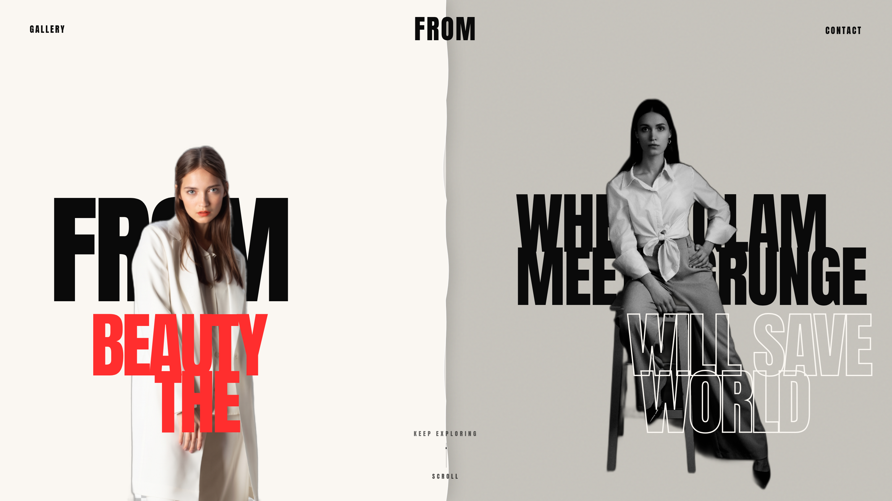

# FROM — Editorial Photographer Portfolio

**Live demo → [from-animated-site.vercel.app](https://from-animated-site.vercel.app/)**

A single-page, scroll-driven portfolio for the fictional fashion photographer **Jack / FROM Studio**. The whole site is one pinned viewport whose sections are choreographed by a single GSAP scroll timeline — as you scroll, sections slide, morph, and hand off to each other like a film cut.

[](https://from-animated-site.vercel.app/)

## Stack

|                 |                                                          |
| --------------- | -------------------------------------------------------- |
| Framework       | [Next.js 16](https://nextjs.org) (App Router, Turbopack) |
| UI              | React 19                                                 |
| Styling         | Tailwind CSS v4                                          |
| Animation       | [GSAP](https://gsap.com) + ScrollTrigger                 |
| QA              | Puppeteer (responsive screenshots)                       |
| Package manager | pnpm                                                     |

## Getting started

```bash
pnpm install
pnpm dev          # http://localhost:3000
```

Other scripts:

```bash
pnpm build        # production build
pnpm start        # serve the production build
pnpm lint         # eslint
```

## How it works

Everything lives in one fixed, full-screen "pinned viewport". A tall spacer element (`h-[7600vh]`) gives the page its scroll length, and a single scrubbed GSAP timeline in [`app/page.tsx`](app/page.tsx) maps scroll progress to the whole choreography. Each section is absolutely positioned inside the viewport and is shown/hidden/animated by the timeline via shared class hooks (e.g. `.hero-*`, `.video-*`, `.eb-*`, `.gallery-*`, `.reveal-line`, `.footer`).

**Section order (scroll top → bottom):**

1. **Loader** — a preloader with the `FROM` logo whose **O is a spinning camera aperture**; the mark fills with the load counter, then the panel slides away.
2. **Hero** — split background, layered typography, model images, and a scroll cue (with an idle "keep exploring" nudge).
3. **Video** — cinematic intermission of three clips that reveal, morph, and slide.
4. **Editorial Break** — sliding colored bands (green / charcoal / red) with big boundary words and a line-by-line poem reveal.
5. **Gallery** — a dark-red stage where five center images fly in one-by-one to build a deck, then supportive images rise from the bottom. Hover a card to see it pop to full color.
6. **TextSection (footer)** — the resting frame: a big statement, three info columns, a rotating "available for commissions" seal, a giant `FROM` wordmark, and **VIEW THE FULL ARCHIVE**, which opens a full-screen image archive overlay.

The nav (`GALLERY · FROM · CONTACT`) recolors per section and hides entirely during the Editorial Break.

## Project structure

```
app/
  page.tsx          # the master GSAP scroll timeline + section composition
  layout.tsx        # fonts (Anton, Playfair Display, Geist) + metadata
  globals.css       # theme tokens + a few custom utilities
components/
  Loader.tsx            # aperture-logo preloader
  Header.tsx            # nav (desktop + mobile drawer)
  BackgroundSplit.tsx   # ┐
  BackgroundTypography.tsx
  ModelImages.tsx       # ├ Hero layers
  ForegroundTypography.tsx
  ScrollCue.tsx         # ┘ scroll indicator + idle nudge
  VideoSection.tsx
  EditorialBreakSection.tsx
  Gallery.tsx
  TextSection.tsx       # footer composition + archive overlay
public/                 # images (jpg/png) + video1..3.mp4
```

## Customizing

- **Timing / choreography:** the timeline positions live in [`app/page.tsx`](app/page.tsx). Numbers like `2.14`, `3.20` are timeline positions (not seconds) — later sections are hidden at init, then revealed at their cue.
- **Copy & content:** each section owns its text. Contact details, socials, and the archive list are near the top of [`components/TextSection.tsx`](components/TextSection.tsx).
- **Palette:** the footer/archive use onyx `#0B0B0D`, ivory `#ECE7DE`, and an oxblood `#A23A3A` accent; the Gallery is dark red; the Editorial Break uses green/charcoal/red bands.
- **Assets:** swap the files in `public/` (keep the names, or update the references in the components).

## Notes

- This is a heavily desktop-choreographed experience; it also reflows and stays legible on mobile (verified at 390px and 1440px).
- Animations honor `prefers-reduced-motion` where it matters (loader, scroll cue).

## Credits

All assets — images and videos — are from [Unsplash](https://unsplash.com/).

> This is a design/portfolio demo, not a real studio.
